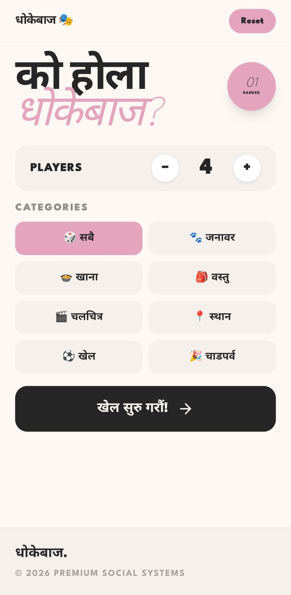
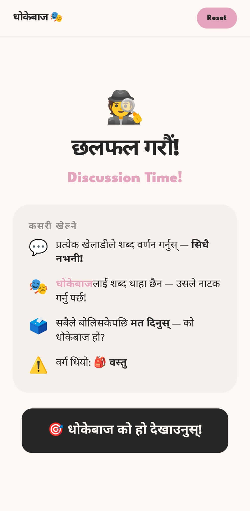
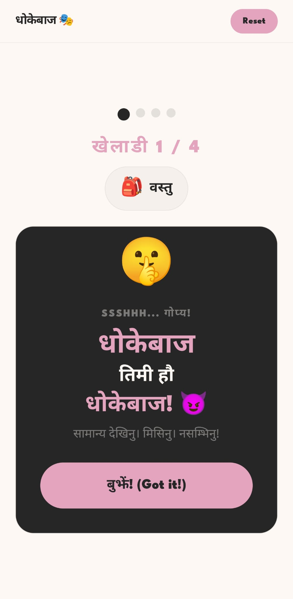
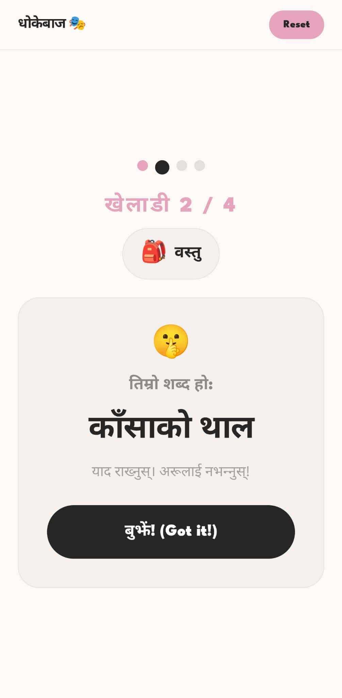
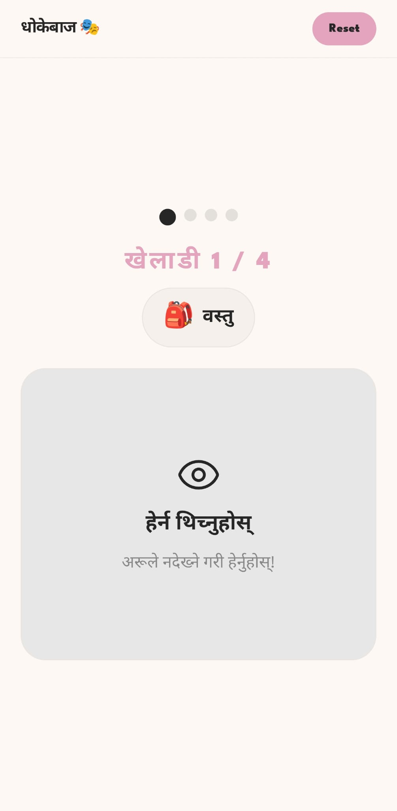

# 🎭 Nepali Imposter - Social Deduction Game

A fun, interactive **social deduction word game** built with React where players must describe Nepali words while one player (the Imposter) doesn't know the word and must bluff their way through the discussion!

**[🎮 Play Now](https://imposter-nepali-game.vercel.app/)** | **[GitHub](https://github.com/sabin147/imposter-NepaliGame)**

---

## 🎮 How To Play

### छलफल गरौं! (Discussion Time!)

The game is all about **bluffing, deduction, and discussion** — just like Mafia or Werewolf, but in Nepali!

#### 🎯 Game Rules

**💬 प्रत्येक खेलाडीले शब्द वर्णन गर्नुस्** (Every player describes the word)
- Everyone gets a **meaningful Nepali word** related to a category
- **One random player** (the Imposter) gets the **category only** — NOT the actual word
- All players describe the word in their own words (without saying it directly!)

**🎭 धोकेबाजलाई शब्द थाहा छैन** (The Imposter doesn't know the word)
- The Imposter must **listen carefully** to others' descriptions
- They must **bluff and guess** what the word is
- They can't reveal they don't know the word — they must participate in the discussion!

**🗳️ सबैले बोलिसकेपछि मत दिनुस्** (Vote after everyone speaks)
- After the discussion round, all players **vote** on who they think is the Imposter
- If the majority votes correctly → **Others win! 🎉**
- If they vote wrong → **Imposter wins! 🕵️**

**⚠️ वर्ग थियो: 📍 स्थान** (The category was: Locations)
- At the end of voting, the word is **revealed**
- Everyone discovers if their deduction was correct

---

## 🎯 Game Flow

```
1. SELECT CATEGORY → Choose from Animals, Food, Places, Objects, etc.
   ├─ All Players Get: The Nepali word
   └─ Imposter Gets: Only the category

2. DISCUSSION ROUND (2-3 minutes)
   ├─ Player 1: "यो अँधारोमा खेल्छ..." (Describes clues about the word)
   ├─ Player 2: "यो सिमेन्ट र पथ्थरको..."
   ├─ Imposter: [Listens carefully, tries to guess, bluffs]
   └─ Repeat until all describe

3. VOTING PHASE
   ├─ Everyone votes: "को धोकेबाज हो?" (Who is the Imposter?)
   ├─ Count votes
   └─ Announce result

4. REVEAL
   ├─ The actual word is revealed
   ├─ Imposter's bluffing ability is judged
   └─ Points awarded to winners
```

---

## ✨ Features

- **🎭 Multiple Game Modes**
  - Solo Practice (Learn words)
  - Multiplayer (2-6 players)
  - Online/Local Play

- **📚 Rich Categories** with 50+ Nepali words each:
  - 🐾 **जनावर** (Animals) - सिंह, बाघ, हात्ती, etc.
  - 🍲 **खाना** (Food) - दाल, चामल, मोमो, etc.
  - 📍 **स्थान** (Places/Locations) - घर, पहाड, बजार, etc.
  - 🏠 **वस्तु** (Objects) - किताब, पेन्सिल, मेज, etc.
  - 🌈 **रङ** (Colors) - रातो, नीलो, पहेंलो, etc.
  - 🎲 **Random** - Mix of all categories

- **📱 Responsive Design** - Works on desktop, tablet, and mobile
- **🎨 Beautiful UI** - Purple gradient with smooth animations
- **🇳🇵 Full Nepali Support** - Complete Nepali language gameplay
- **⚡ Real-time Discussion** - Group chat during discussion round
- **🕐 Timer** - Built-in discussion timer (2-3 minutes)
- **📊 Score Tracking** - Keep track of wins/losses and imposter success rate
- **🎭 Imposter Character** - Cute custom character with traditional Dhaka Topi

---

## 🚀 Technologies Used

| Technology | Purpose |
|-----------|---------|
| **React 18** | Interactive UI & game state management |
| **Vite** | Fast build tool & dev server |
| **Tailwind CSS** | Beautiful responsive styling |
| **Lucide React** | SVG icons & UI elements |
| **PostCSS** | CSS preprocessing |

---

### Screenshots

<div style="display: flex; gap: 20px; flex-wrap: wrap; justify-content: center;">
  <div>
    <h4>Category Selection</h4>
    
  </div>
  <div>
    <h4>Discussion Round</h4>
    
  </div>
  <div>
    <h4>Imposter Screen</h4>
    
  </div>
  <div>
    <h4>Game Play</h4>
    
  </div>
  <div>
    <h4>Rules</h4>
    
  </div>
</div>
---

## 🛠️ Installation & Setup

### Prerequisites
- Node.js (v16 or higher)
- npm or yarn

### Quick Start

```bash
# 1. Clone the repository
git clone https://github.com/sabin147/imposter-NepaliGame.git
cd imposter-NepaliGame

# 2. Install dependencies
npm install

# 3. Start development server
npm run dev

# 4. Open in browser
# Navigate to http://localhost:5173
```

### Build for Production

```bash
npm run build
```

---

## 📁 Project Structure

```
imposter-NepaliGame/
├── src/
│   ├── App.jsx              # Main game component & game logic
│   ├── App.css              # Game styling (Tailwind + custom)
│   ├── Logo.jsx             # Imposter character SVG component
│   ├── index.css            # Global styles & animations
│   ├── main.jsx             # React entry point
│   └── public/              # Static assets
├── index.html               # HTML template
├── package.json             # Dependencies & scripts
├── vite.config.js           # Vite configuration
├── tailwind.config.js       # Tailwind CSS config
└── README.md                # This file
```

---

## 🎓 Game Strategy Tips

### For Regular Players 👥
- **Listen carefully** to descriptions - they often reveal hints about the word
- **Ask questions** - "क्या यो खाने योग्य हो?" (Is it edible?)
- **Take notes** - Remember who said what
- **Identify suspicious speech** - Who's being too vague or too specific?

### For the Imposter 🕵️
- **Listen intently** - Gather clues from others' descriptions
- **Ask open questions** - "यसको विशेषता के हो?" (What's special about it?)
- **Don't ask too many questions** - You'll sound suspicious
- **Mimic others' language** - Use similar vocabulary they used
- **Stay calm** - Don't act defensive

---

## 📊 Scoring System

| Action | Points |
|--------|--------|
| Correctly identify Imposter | +10 pts |
| Deceive others as Imposter | +15 pts |
| Guess the word as Imposter | +20 pts |
| Survive voting without detection | +5 pts |

---

## 🎭 Game Modes

### 🎯 Solo Practice Mode
- Learn Nepali words at your own pace
- No pressure, just read descriptions
- Perfect for language learning

### 👥 Multiplayer Mode (Local)
- 3-6 players on same device
- Pass device between players for each round
- Great for group gatherings

### 🌐 Online Multiplayer (Coming Soon)
- Play with friends remotely
- Real-time discussion chat
- Live voting system

---

## 🎨 Design Features

- **Color Scheme**: Purple gradient (Primary) with cream/beige secondary cards
- **Custom Character**: Nepali Imposter with traditional Dhaka Topi hat
- **Animations**: Smooth transitions, floating effects, button press feedback
- **Mobile-First**: Optimized for all screen sizes
- **Accessibility**: High contrast text, large touch targets, Nepali language support
- **Dark Mode**: (Future feature)

---

## 🚀 Deployment

### Deploy to Vercel (Recommended)
```bash
npm i -g vercel
vercel
```

### Deploy to Netlify
```bash
npm run build
# Upload 'dist' folder to Netlify
```

### Deploy to GitHub Pages
```bash
npm run build
# Push 'dist' folder to gh-pages branch
```

---

## 📊 Word Categories & Lists

### 🐾 Animals (जनावर)
सिंह, बाघ, हात्ती, जिराफ, जेब्रा, क्यांगारू, पेंगुइन, पाण्डा, ब्वाँसो, स्याल, चील, सार्क, डल्फिन, व्हेल, अक्टोपस, गोरिल्ला, चिम्पान्जी, कोआला, भालु, उँट...

### 🍲 Food (खाना)
दाल, चामल, मोमो, अचार, रोटी, भात, सब्जी, मछली, कुखुरा, गोमास, दही, पनीर, तुलसी...

### 📍 Places (स्थान)
घर, पहाड, बजार, स्कुल, अस्पताल, मेलिन, पार्क, नदी, झरना, मन्दिर, पुल, गाउँ, शहर...

### 🏠 Objects (वस्तु)
किताब, पेन्सिल, कलम, मेज, कुर्सी, दरवाजा, झ्याल, दीप, बत्ती, मोमबत्ती, घडी...

### 🌈 Colors (रङ)
रातो, नीलो, पहेंलो, हरियो, कालो, सेतो, गुलाबी, नारंगी, गाढा, हल्का...

---

## 🤝 Contributing

Found a bug or have feature ideas? Contributions are welcome!

1. Fork the repository
2. Create a feature branch (`git checkout -b feature/amazing-feature`)
3. Commit changes (`git commit -m 'Add amazing feature'`)
4. Push to branch (`git push origin feature/amazing-feature`)
5. Open a Pull Request

### 💡 Suggested Features
- [ ] Online multiplayer support
- [ ] Game history & statistics
- [ ] Custom word lists
- [ ] Sound effects & voice
- [ ] Leaderboard system
- [ ] Dark mode theme
- [ ] More languages support
- [ ] Mobile app (React Native)
- [ ] AI Imposter bot

---

## 📝 License

This project is licensed under the **MIT License** - see the LICENSE file for details.

---

## 🙏 Credits & Inspiration

- **Game Concept**: Similar to Mafia, Werewolf, and "Impostor" party games
- **Nepali Language**: Rich vocabulary from Nepali literature & daily usage
- **UI/UX**: Modern design principles and web accessibility standards
- **Built with**: React, Vite, Tailwind CSS, and ❤️

---

## 📧 Support & Feedback

Have questions, found bugs, or have feature ideas?

- **GitHub Issues**: [Report a bug](https://github.com/sabin147/imposter-NepaliGame/issues)
- **GitHub Discussions**: [Ask questions](https://github.com/sabin147/imposter-NepaliGame/discussions)
- **Email**: sabinghimire071@gmail.com

---

## 🗺️ Roadmap

- [x] Core game mechanics (Discussion, Voting, Reveal)
- [x] Category-based word selection
- [x] Imposter role assignment
- [x] Beautiful Nepali UI
- [ ] Online multiplayer
- [ ] Real-time discussion timer
- [ ] Score tracking & leaderboard
- [ ] Game statistics & history
- [ ] Custom word lists
- [ ] Voice/audio support
- [ ] Mobile app version

---

**खेलौं! हलिमा फेरि भेटौं! 🎭**

(Let's Play! See you next game!)

---

**Made with ❤️ by [sabin147](https://github.com/sabin147)**
